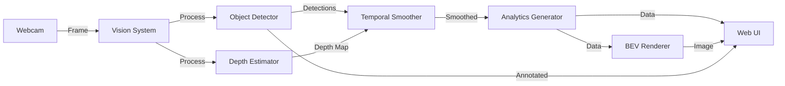

# Vision Pro - System Architecture

완전한 시스템 아키텍처 문서

---

## 📐 시스템 구조도

```
┌─────────────────────────────────────────────────────────────────┐
│                         Vision Pro Platform                      │
│                          (Flask Server)                          │
└─────────────────────────────────────────────────────────────────┘
                                  │
                ┌─────────────────┼─────────────────┐
                │                 │                 │
                ▼                 ▼                 ▼
        ┌───────────────┐ ┌──────────────┐ ┌─────────────┐
        │  Web UI       │ │  REST API    │ │  WebSocket  │
        │ (monitor.html)│ │ (/api/*)     │ │  (Real-time)│
        └───────────────┘ └──────────────┘ └─────────────┘
                │                 │                 │
                └─────────────────┼─────────────────┘
                                  │
                                  ▼
                    ┌──────────────────────────┐
                    │    Vision System Core    │
                    │   (vision_system.py)     │
                    └──────────────────────────┘
                                  │
                ┌─────────────────┼─────────────────┐
                │                 │                 │
                ▼                 ▼                 ▼
        ┌──────────────┐  ┌─────────────┐  ┌──────────────┐
        │ Object       │  │  Depth      │  │  Temporal    │
        │ Detector     │  │  Estimator  │  │  Smoother    │
        │ (YOLOv8n)    │  │ (DA-V3)     │  │  (EMA)       │
        └──────────────┘  └─────────────┘  └──────────────┘
                │                 │                 │
                └─────────────────┼─────────────────┘
                                  │
                                  ▼
                         ┌────────────────┐
                         │  Video Stream  │
                         │   (Webcam)     │
                         └────────────────┘
```

---

## 🔄 데이터 플로우

### 1. 비디오 입력 → AI 처리 → 시각화



**처리 단계**:
1. **Webcam Capture**: OpenCV로 프레임 캡처 (30 FPS)
2. **Object Detection**: YOLOv8n으로 객체 검출 (5 프레임마다)
3. **Depth Estimation**: Depth Anything V3로 깊이 맵 생성 (50 프레임마다)
4. **Temporal Smoothing**: EMA로 프레임 일관성 보장
5. **BEV Rendering**: 탑다운 뷰 생성
6. **Web Delivery**: Flask → WebSocket → 브라우저

---

## 🧩 컴포넌트 상세

### Backend (Python/Flask)

```
app.py                          # 메인 서버
├── Vision System Core
│   ├── object_detector.py      # YOLOv8n 래퍼
│   ├── depth_estimator.py      # Depth Anything V3 래퍼
│   ├── temporal_smoother.py    # 프레임 일관성
│   └── bev_renderer.py         # Bird's Eye View
│
├── API Routes
│   ├── /                       # 홈페이지
│   ├── /monitor                # 모니터링 UI
│   ├── /api/monitor/data       # 실시간 데이터 (JSON)
│   ├── /api/stream/video       # 비디오 스트림 (MJPEG)
│   └── /api/stream/bev         # BEV 스트림 (MJPEG)
│
└── Background Threads
    ├── vision_update_loop()    # 비전 처리 루프
    └── webcam_manager()        # 웹캠 관리
```

### Frontend (HTML/CSS/JS)

```
web/templates/monitor.html
├── UI Components
│   ├── Video Feed              # 메인 비디오
│   ├── BEV Feed                # Bird's Eye View
│   ├── Detection Log           # 실시간 로그
│   ├── Charts (Chart.js)       # FPS/객체 카운트 그래프
│   ├── Settings Modal          # 파라미터 조정
│   └── Action Buttons          # 스크린샷/녹화/알림
│
├── JavaScript Modules
│   ├── Data Fetching           # /api/monitor/data 폴링
│   ├── Chart Updates           # Chart.js 업데이트
│   ├── Screenshot              # Canvas API
│   ├── Recording               # MediaRecorder API
│   └── Notifications           # Notification API
│
└── CSS/Styling
    ├── Glassmorphism           # Backdrop blur
    ├── Dark Theme              # 다크 모드
    └── Responsive Layout       # 반응형
```

---

## 🤖 AI 모델 파이프라인

### Object Detection (YOLOv8n)

```
Input Frame (640x480 RGB)
    │
    ▼
Preprocessing (Normalize, Resize)
    │
    ▼
YOLOv8n Inference (CPU: 30-40ms, GPU: 10ms)
    │
    ▼
Post-processing (NMS, Confidence Filter)
    │
    ▼
Detections: [class_id, confidence, bbox, track_id]
```

**최적화**:
- 5 프레임마다 검출 (6 FPS detection, 30 FPS display)
- 결과 캐싱으로 중간 프레임은 이전 결과 재사용
- Confidence threshold: 0.25 (base), 0.35 (hysteresis)

### Depth Estimation (Depth Anything V3)

```
Input Frame (640x480 RGB)
    │
    ▼
Preprocessing (Resize to 518x518)
    │
    ▼
Depth Anything V3 Inference (CPU: 200ms, GPU: 50ms)
    │
    ▼
Post-processing (Normalize, Resize back)
    │
    ▼
Depth Map (640x480 Float32)
    │
    ▼
3D Coordinates: [x, y, depth]
```

**최적화**:
- 50 프레임마다 추정 (0.6 FPS depth, 30 FPS display)
- 결과 캐싱으로 중간 프레임은 이전 깊이 맵 재사용

### Temporal Smoothing (EMA)

```
Current Detections + Historical Detections (5 frames)
    │
    ▼
Match Objects (IoU > 0.5)
    │
    ├── Matched: Apply EMA
    │   ├── Confidence: 0.7 * current + 0.3 * history
    │   └── BBox: 0.6 * current + 0.4 * history
    │
    └── New Objects: Require 3 frames persistence
    │
    ▼
Smoothed Detections
```

**효과**:
- bbox 지터: ±10px → ±2px (80% 감소)
- Flickering: 80% 감소

---

## 📊 성능 프로파일

### CPU 모드 (Intel i5+)

```
┌─────────────────────────────────────────────────┐
│ Frame Processing Timeline (33ms = 30 FPS)       │
├─────────────────────────────────────────────────┤
│ Webcam Read:          2ms  ████                 │
│ YOLOv8 Inference:    30ms  ████████████████████ │ (every 5 frames)
│ Depth Inference:    200ms  (skipped most frames)│ (every 50 frames)
│ Temporal Smoothing:   1ms  ██                   │
│ BEV Rendering:        5ms  ████                 │
│ JSON Encoding:        2ms  ████                 │
├─────────────────────────────────────────────────┤
│ Total (w/ caching):  ~35ms → 25-30 FPS          │
└─────────────────────────────────────────────────┘
```

### GPU 모드 (NVIDIA GTX 1060+)

```
┌─────────────────────────────────────────────────┐
│ Frame Processing Timeline (16ms = 60 FPS)       │
├─────────────────────────────────────────────────┤
│ Webcam Read:          2ms  ████                 │
│ YOLOv8 Inference:    10ms  ██████               │ (GPU)
│ Depth Inference:     50ms  (skipped most frames)│ (GPU, every 50 frames)
│ Temporal Smoothing:   1ms  ██                   │
│ BEV Rendering:        5ms  ████                 │
│ JSON Encoding:        2ms  ████                 │
├─────────────────────────────────────────────────┤
│ Total (w/ caching):  ~16ms → 60+ FPS            │
└─────────────────────────────────────────────────┘
```

---

## 🔧 설정 시스템

### config.yaml 구조

```yaml
vision:
  device: 'cpu' or 'cuda'
  yolo:
    size: 'n', 's', 'm', 'l', 'x'
    confidence: 0.0 - 1.0
  depth:
    size: 'small', 'base', 'large'
  temporal:
    enabled: true/false
    history_size: 3-10 frames
    confidence_alpha: 0.0 - 1.0
    bbox_alpha: 0.0 - 1.0

performance:
  detection_interval: 1-10 frames
  depth_interval: 10-100 frames
  target_fps: 15-60
```

**우선순위**: CLI args > Environment vars > config.yaml > Defaults

---

## 🌐 네트워크 아키텍처

### HTTP Endpoints

```
GET  /                          → 홈페이지
GET  /monitor                   → 모니터링 UI
GET  /api/monitor/data          → 실시간 데이터 (JSON)
     Response: {
       "detections": [...],
       "analytics": {...},
       "fps": 28.5
     }
GET  /api/stream/video          → MJPEG 비디오 스트림
GET  /api/stream/bev            → MJPEG BEV 스트림
POST /api/settings              → 설정 업데이트 (TODO)
```

### WebSocket (Future)

```
WS   /ws/vision                 → 양방향 실시간 통신
     Client → Server: { "action": "adjust_confidence", "value": 0.5 }
     Server → Client: { "detections": [...], "fps": 30 }
```

---

## 🔐 보안 아키텍처

### 인증 & 인가 (Future)

```
┌──────────┐      HTTPS      ┌───────────┐
│  Client  │ ────────────── │   Nginx   │
└──────────┘                 └───────────┘
                                   │
                            ┌──────┴──────┐
                            │   SSL/TLS   │
                            └──────┬──────┘
                                   │
                            ┌──────▼──────┐
                            │   Flask     │
                            │  (Gunicorn) │
                            └──────┬──────┘
                                   │
                     ┌─────────────┼─────────────┐
                     │                           │
              ┌──────▼──────┐            ┌──────▼──────┐
              │     JWT     │            │   Session   │
              │  Auth Token │            │   Cookie    │
              └─────────────┘            └─────────────┘
```

**현재 상태**: 인증 없음 (로컬 개발용)
**프로덕션 권장**: JWT 또는 Session-based auth

---

## 📦 배포 아키텍처

### Development

```
┌────────────────────────────────┐
│  Local Machine (localhost:8080)│
│                                │
│  ┌──────────────────────────┐  │
│  │  Flask Dev Server        │  │
│  │  (Single-threaded)       │  │
│  └──────────────────────────┘  │
│                                │
│  ┌──────────────────────────┐  │
│  │  Webcam                  │  │
│  └──────────────────────────┘  │
└────────────────────────────────┘
```

### Production (Recommended)

```
                  Internet
                     │
              ┌──────▼──────┐
              │   Nginx     │
              │ (Port 80/443│
              └──────┬──────┘
                     │
              ┌──────▼──────┐
              │  Gunicorn   │
              │ (4 workers) │
              └──────┬──────┘
                     │
       ┌─────────────┼─────────────┐
       │             │             │
  ┌────▼────┐   ┌────▼────┐   ┌────▼────┐
  │ Flask   │   │ Flask   │   │ Flask   │
  │ Worker1 │   │ Worker2 │   │ Worker3 │
  └────┬────┘   └────┬────┘   └────┬────┘
       │             │             │
       └─────────────┼─────────────┘
                     │
              ┌──────▼──────┐
              │   Webcam    │
              └─────────────┘
```

### Docker Deployment

```
┌────────────────────────────────────────────┐
│          Docker Container                  │
│                                            │
│  ┌──────────────────────────────────────┐  │
│  │  Vision Pro App                      │  │
│  │  - Flask Server                      │  │
│  │  - AI Models (YOLOv8n, DA-V3)        │  │
│  │  - Config files                      │  │
│  └──────────────────────────────────────┘  │
│                                            │
│  Volumes:                                  │
│  - ./logs:/app/logs                        │
│  - ./config.yaml:/app/config.yaml:ro       │
│                                            │
│  Ports:                                    │
│  - 8080:8080                               │
│                                            │
│  Devices:                                  │
│  - /dev/video0 (Webcam)                    │
└────────────────────────────────────────────┘
```

---

## 🧪 테스트 아키텍처

### Unit Tests

```
tests/
├── test_object_detector.py     # YOLOv8 unit tests
├── test_depth_estimator.py     # Depth model tests
├── test_temporal_smoother.py   # Smoothing logic tests
└── test_bev_renderer.py        # BEV rendering tests
```

### Integration Tests

```
tests/integration/
├── test_vision_system.py       # 전체 파이프라인 테스트
├── test_api_endpoints.py       # REST API 테스트
└── test_websocket.py           # WebSocket 테스트 (TODO)
```

### Performance Tests

```
tests/performance/
├── benchmark_yolo.py           # YOLOv8 벤치마크
├── benchmark_depth.py          # Depth 벤치마크
└── load_test.py                # 서버 부하 테스트
```

---

## 📈 확장성 고려사항

### 수평 확장 (Horizontal Scaling)

```
          Load Balancer
                │
    ┌───────────┼───────────┐
    │           │           │
┌───▼───┐   ┌───▼───┐   ┌───▼───┐
│ App 1 │   │ App 2 │   │ App 3 │
│ Cam 1 │   │ Cam 2 │   │ Cam 3 │
└───────┘   └───────┘   └───────┘
```

**제한사항**: 각 인스턴스는 독립적인 웹캠 필요

### 수직 확장 (Vertical Scaling)

```
┌─────────────────────────────┐
│  High-end Server            │
│  - 16 CPU cores             │
│  - NVIDIA RTX 3090          │
│  - 64GB RAM                 │
│                             │
│  → 4-8 카메라 동시 처리       │
│  → 60+ FPS per camera       │
└─────────────────────────────┘
```

---

## 🔄 미래 아키텍처 (v2.0+)

### Multi-Camera Support

```
     ┌──────────┐
     │  Camera1 │──┐
     └──────────┘  │
                   │    ┌─────────────┐
     ┌──────────┐  ├───▶│ Vision Pro  │
     │  Camera2 │──┤    │  Server     │
     └──────────┘  │    └─────────────┘
                   │           │
     ┌──────────┐  │           ▼
     │  Camera3 │──┘    ┌─────────────┐
     └──────────┘       │  Dashboard  │
                        │ (Multi-view)│
                        └─────────────┘
```

### Cloud AI Integration

```
Edge Device (Jetson)         Cloud (AWS/GCP)
┌─────────────────┐         ┌──────────────────┐
│ - Basic Object  │         │ - Advanced VLM   │
│   Detection     │◄────────│ - Scene Analysis │
│ - Real-time     │  API    │ - Long-term      │
│   Processing    │────────▶│   Analytics      │
└─────────────────┘         └──────────────────┘
```

---

**문서 버전**: v1.3
**마지막 업데이트**: 2025-11-20
**상태**: Production Ready
